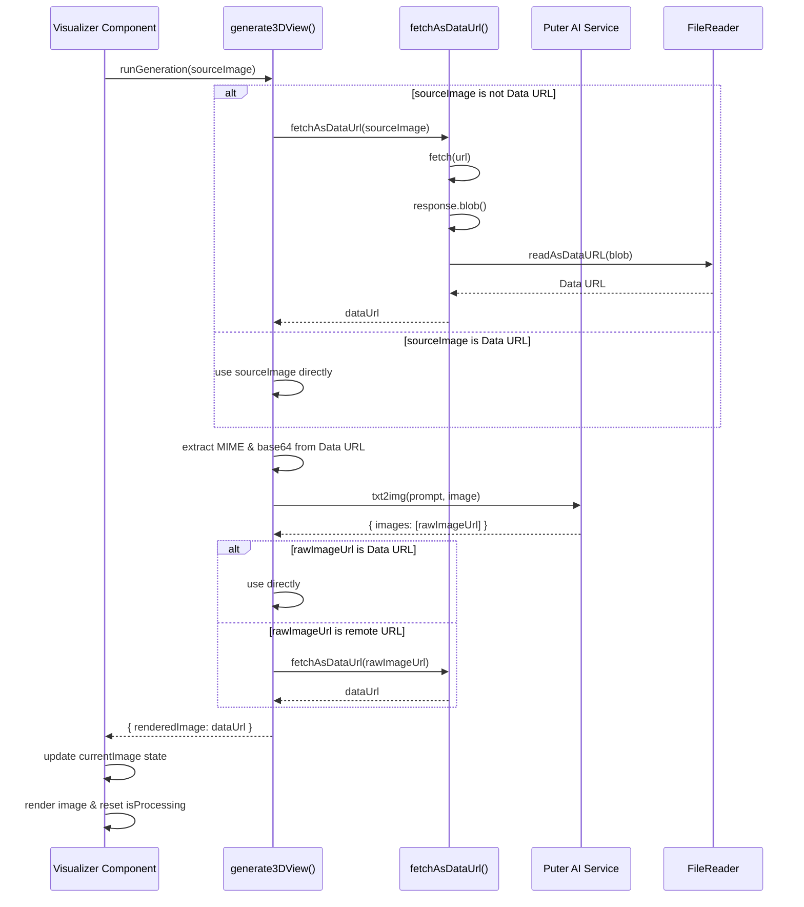

# Raumorph – AI-Powered Interior Visualization

A modern web application that allows users to upload 2D floor plans and generate photorealistic 3D room renders. This project demonstrates a fully interactive UI, reusable components, and integration with backend services.

<p align="center">
  
  
  
</p>

---
## Update log 0.8
### New Features
WebP file format now supported for uploads
Added image comparison panel with interactive slider to visually compare original and rendered images side-by-side
Export rendered images as PNG files for download

## Update log 0.7.3
### New Features
Image upload and hosting capability
Saved projects support
Visualizer state routing for seamless navigation
Export and share functionality for rendered images
### Improvements
Enhanced visualizer UI with project metadata display and navigation controls
Added visual feedback during image generation with processing overlay
Updated installation instructions and documentation with new Functionalities section

## Update log 0.6.3
### New Features
Image hosting and upload with automatic hosting setup, multi-format handling, and PNG rendering for certain images.
Save projects from uploads; Home displays saved projects with dynamic timestamps and thumbnails.
Visualizer accepts routed project state and shows project title and source image.
Expanded public types/interfaces for components and hosting APIs.
### Updates
Added Key "Functionalities" section to README.
Package version updates for routing libraries.

## Update log 0.5.6
### New Features
Drag-and-drop and click-to-upload interface for floor plan images (JPG/PNG, 10 MB) with upload progress and completion flow
New visualizer view to process/display uploaded floor plans via a navigation-based upload flow
### Updates
Added application-wide constants for timing, UI, and rendering settings

---

## 🔗 Live Demo

<!-- Optional: Add if you deploy it somewhere -->
[Live Demo](#) coming!
---

## 🛠 Tech Stack

- **Frontend:** React, TypeScript, Tailwind CSS
- **Backend / API:** Serverless functions, AI image processing , PuterJs
- **State Management:** React Hooks, Context API
- **Styling & Components:** Reusable component architecture, responsive design

---
## ⚡ Key Functionalities



## ⚡ Key Features

- Upload 2D floor plans and generate AI-based 3D floor renders with Gemini
- Responsive user interface with Tailwind CSS
- Reusable components with type-safe props (TypeScript)
- User authentication and session management
- Interactive before/after image comparisons
- Project gallery and download functionality

---

## 🚀 Installation & Setup

1. Clone the repository:

```bash
git clone https://github.com/maherhms/FloorPlan-Rendering-Application.git
cd FloorPlan-Rendering-Application
```

2. Install dependencies:

```bash
npm install
# or
yarn install
```

3. Configure environment variables:
   Copy `.env.local.example` to `.env.local` and fill in the required values:
```bash
cp .env.local.example .env.local
```

4. Start the development server:

```bash
npm run dev
# or
yarn dev
```
---

## 📌 References

- Original GitHub repository: [Adrian Hajdin – Roomify](https://github.com/adrianhajdin/roomify)
- YouTube Tutorial: [JavaScript Mastery – Roomify Tutorial](https://www.youtube.com/watch?v=JiwTGGGIhDs&t=2179s)

---

## 📖 Notes

This project is part of my portfolio to showcase hands-on experience with modern web technologies, React patterns, and TypeScript best practices.
